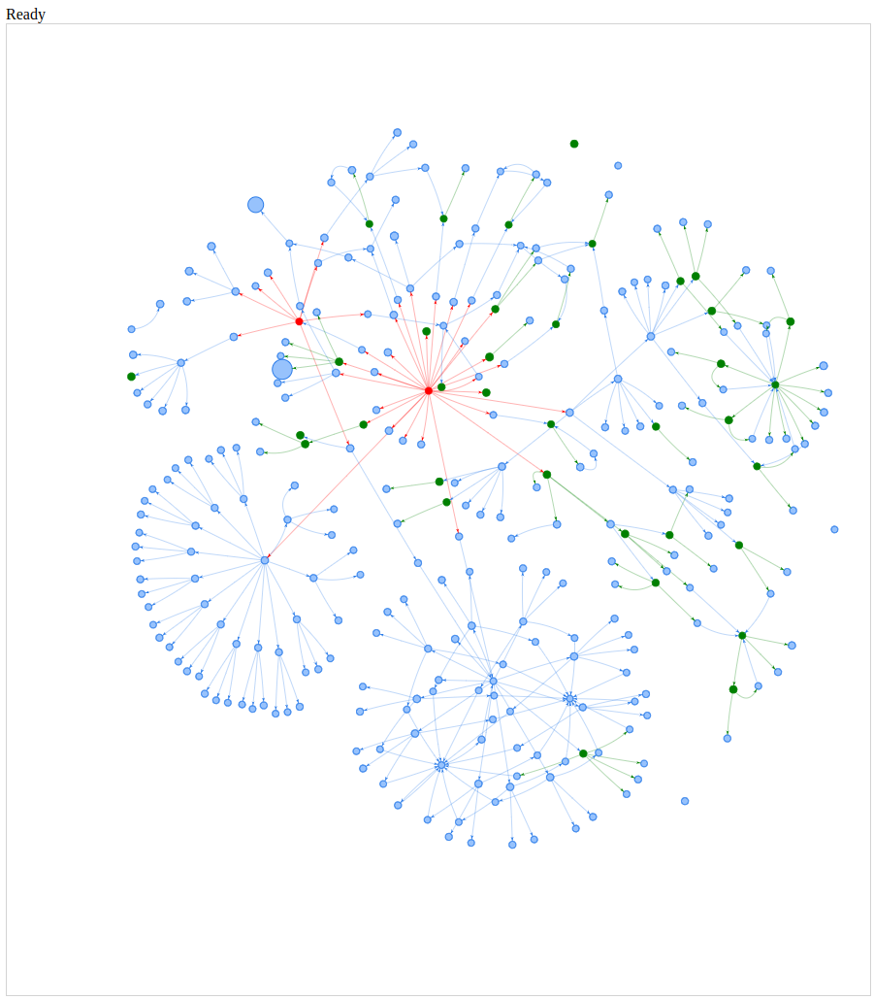

Espruino Memory Viewer
=======================

This tool allows you to connect to an [Espruino](https://www.espruino.com/)/Bangle.js device via Web Bluetooth
and then display the contents of RAM as a Network.

It's a good way to look into your code and see if there's anything obviously using memory that shouldn't be.

To use it:

* [Open this link](https://espruino.github.io/EspruinoMemView/vis.html)
* Click `Connect`
* Wait...
* Then click and drag and use the mousewheel to zoom
* Clicking on a node will show you information about that node at the top, including a calculated `path`
which may be able to show you where the variable is defined.

* **RED** are `global` and `hidden` objects in Espruino
* **GREEN** are functions
* **GREY** links are added between array/object elements to enforce ordering

After initially connecting, you might want to do something on your device that is causing memory usage
to increase, and then click the `Diff` button. This will scan all memory again and will make all variables
that were previously allocated grey (note that if variables have moved around, it is possible that new
variables will be turned grey instead).